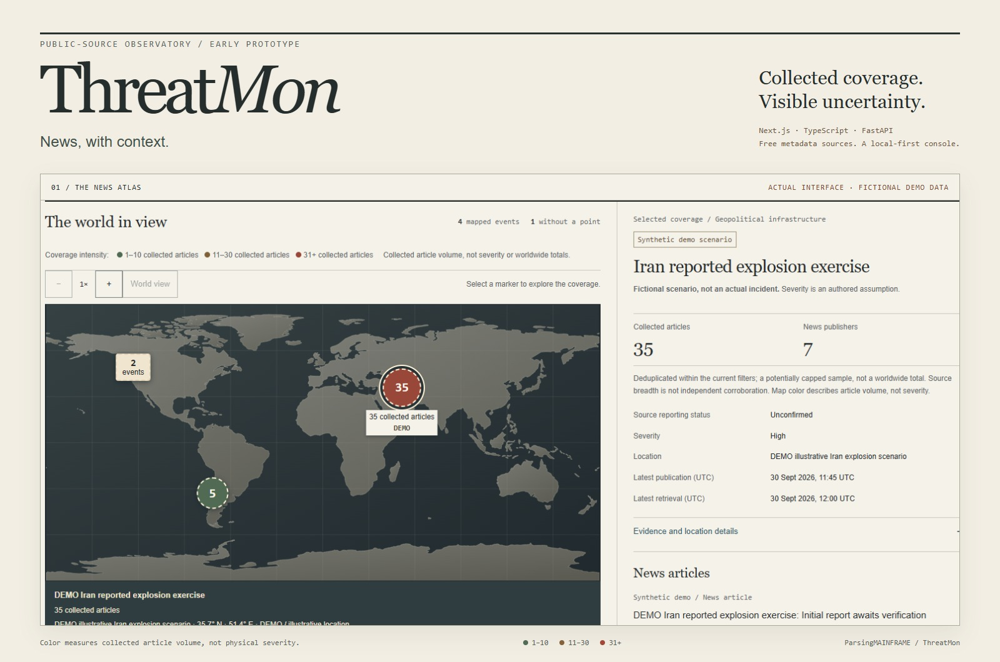
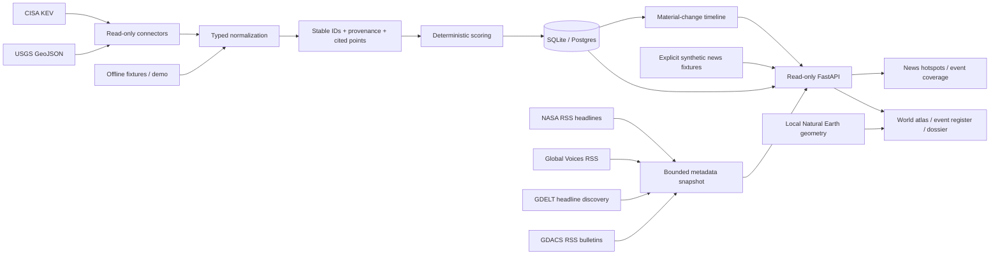

# ThreatMon

A source-cited news and signal observatory. Explore collected reporting, inspect the evidence behind a record, and keep uncertainty in view.

[](https://github.com/ParsingMAINFRAME/ThreatMon/actions/workflows/ci.yml) [](LICENSE) [](#current-capabilities)

Built with **Next.js, TypeScript, FastAPI, SQLAlchemy, and Alembic**. The interface takes its cues from a cartographic atlas and an analyst's report: geography first, compact records, and references beside the assessment.



[Desktop demo](docs/images/release-demo-desktop.jpg) | [Mobile demo](docs/images/release-demo-mobile.jpg) | [Fetched articles](docs/images/release-fetched-desktop.jpg) | [Source status](docs/images/release-source-status.jpg) | [Evidence dossier](docs/images/evidence-brief.jpg)

> **Early-stage prototype.** Metadata ingestion and the interactive demo work. Incident headlines that name one clear city or country are now placed on the map at that place, labeled as an approximate, low-confidence headline mention rather than a verified site. Placement is keyword matching over a gazetteer of about 1,100 cities and 200 countries, so recall is limited and wrong markers are possible. The pictured numbered hotspots are fictional scenarios, not live incidents.

## Current capabilities

| Available now | Boundary |
| --- | --- |
| Free, bounded GDELT discovery, Wikipedia Current events entries and attributed Global Voices headlines | A potentially capped article sample, not comprehensive incident coverage; broad queries can include irrelevant reporting. |
| Canonical URL deduplication, provider observations and conservative candidate matching | Publisher domains are not independent confirmations. Matching groups reports that name the same place and incident type within 24 hours; it has limited recall and can combine separate incidents. |
| Numbered map markers, time filters, coverage panels and shareable selection URLs | Real articles are placed only at a city or country named in an incident headline, marked approximate and low confidence; a country marker is its rough centre, not its capital. Everything else stays unlocated. |
| USGS/CISA signals and secondary GDACS/NASA bulletins | Different source classes and timestamp meanings remain separate. |
| Persisted fetch status, backoff and an optional poller (`news poll`, or `docker compose --profile live up -d`) | Opening the app only reads storage. The poller runs only when you start it; no hosted service or alerts exist. |

Built to make the data boundary inspectable: typed contracts, deterministic grouping, source clocks, uncertainty labels, and a local basemap with no paid map SDK. Start with the [offline demo](#run-the-demo), then review the [pipeline contract](docs/news-pipeline.md).

## Explore the console

- **Incident news (`/`):** event hotspots on a dark map are colored by reported event type (red attacks and strikes, orange unrest, blue natural hazards, purple accidents and outages, gray other news) and sized by collected unique articles; event cards use coverage-intensity colors green 1–10, amber 11–30 and red 31+; severity and reporting status remain separate. Neutral spatial groups open a picker of distinct events. Headlines without one clear named place remain unlocated.
- **Coverage panel:** time filters, publisher breadth, grouping rationale, geographic confidence, and article-level timestamps stay beside the map. Snapshot articles link to their original publisher; synthetic stories open a labeled demonstration preview.
- **Real news first:** the default edition reads GDELT discovery metadata and attributed Global Voices articles. Conservative cross-publisher associations are explicitly unverified candidates. GDELT is a discovery provider, not the publisher; capped query results never represent worldwide totals. GDACS and NASA move to `/signals?view=bulletins`. Synthetic 5-story and 35-story scenarios remain an explicit demo edition.
- **World atlas:** locally rendered Natural Earth coastlines, cited event points, coordinate readouts, bounded zoom and pan, and clear coverage counts. Keyboard controls and a point index make overlapping markers accessible.
- **Event register:** search and filter by category, status, geography, origin, and severity; sort the stored records and open their evidence dossiers.
- **Evidence dossier:** claims link to their sources; uncertainty, contradictory evidence, revisions, and next watch items stay visible beside the scoring rationale.
- **Official snapshot ingestion:** read-only USGS earthquake and CISA KEV connectors run through an operator CLI. Source URLs, retrieval times, content fingerprints, and geographic provenance are retained. The overview shows each feed's last successful fetch and latest-attempt status. Retrievals older than 24 hours are labeled stale under an explicit display policy; refresh reloads storage without fetching feeds.
- **Repeatable revisions:** stable event identities avoid duplicate events; changed facts create timeline entries, including a return to earlier content. Timestamp-only updates create no material-change entry.
- **Reproducible demo:** four source-signal scenarios, six synthetic news events containing 49 unique stories, locked dependencies, and Docker Compose for the API, console, and persistent database. Publication filters change the visible news counts.

This is a portfolio application with bounded snapshot ingestion and an optional operator-started foreground GDELT poller. No polling worker or deployed monitoring service is running by default. It delivers no emergency alerts or impact predictions. Fetched coverage and the news demonstration stay separate; neither silently replaces an unavailable edition. Source signals live at `/signals`.

## What the map represents

News hotspots count **deduplicated collected articles**, not casualties, severity or independent corroboration. Marker size and the card colors encode that article volume; marker color is the reported event type, not severity. Candidate associations require compatible place, incident type, distinctive clues and times; uncertain matching remains labeled. DOC metadata and headline place mentions do not establish incident coordinates, so this milestone does not fabricate a populated city-dot map. See the [pipeline contract and geographic gap](docs/news-pipeline.md).

The secondary GDACS view uses provider event IDs and approximate hazard reference locations; repeat episodes are revisions, not new stories. Official-bulletin counts remain distinct from news articles. NASA agency updates are secondary, too.

The fictional Iran explosion scenario contains 35 synthetic stories and is explicitly unconfirmed; it is not a report of an actual incident. Shared countries or keywords never merge unrelated stories into one event. See [news grouping, source terms, and limitations](docs/news.md).

The separate source-signals atlas shows **stored records with cited point locations**, not comprehensive worldwide incident coverage. Official point ingestion currently comes from USGS's M2.5+ earthquake feed for the past day. Coordinates come directly from its GeoJSON geometry; automatic estimates can be preliminary.

CISA catalog entries have no event point and remain in the register. They are not plotted at a vendor headquarters or assigned a guessed location. The near-Earth object demo has no terrestrial point either. The fresh demo includes two explicitly illustrative points; these are synthetic scenarios, not agency observations.

Markers locate records. Their size, selection guides, and colors do not describe an affected area, population exposure, or a forecast. See [map coverage and provenance](docs/map.md).

## Run the demo

From the repository root, with Docker and Docker Compose installed:

```sh
docker compose up --build -d --wait
```

Open **[localhost:3000](http://localhost:3000)**. The default real-coverage edition is empty until an operator imports sources; choose **Demo scenarios** for the offline interaction demo. API documentation is at **[localhost:8000/docs](http://localhost:8000/docs)**. Startup requires no credentials or source network calls; the first image build downloads dependencies.

```sh
docker compose down
```

Data persists in the `threatroom-data` volume. The default services bind to your local machine. The optional Postgres service uses the `postgres` profile; the default app uses SQLite.

## A two-minute walkthrough

1. Open the synthetic news edition and select the green 5-article hotspot or red 35-article scenario. Read the synthetic label and coverage-intensity legend; these colors do not encode severity.
2. Open a story preview; compare story count with publisher breadth. Change the time window and inspect the global/unlocated buckets.
3. Select a group of nearby events. Its event picker preserves each event's own coverage rather than merging incidents because they are close together.
4. Visit **Source signals** for the separate USGS/CISA register. Open a dossier and inspect source citations, revisions, and score assumptions.
5. Import real coverage, then choose the fetched edition:

```sh
docker compose exec backend /app/.venv/bin/python -m app.cli news ingest --source all
```

This attempts the bounded GDELT query and fetches Global Voices, GDACS and NASA independently. The primary news view uses GDELT/Global Voices; hazard and agency bulletins have a separate view. Rate-limited or failed sources retain their status and prior records. No synthetic hotspots are added to fetched coverage. Import an official earthquake snapshot separately to exercise the source-signals map pipeline:

```sh
docker compose exec backend /app/.venv/bin/python -m app.cli ingest --connector usgs_earthquakes
```

That command fetches the official USGS feed and adds source-reported points alongside the demo. For a fully offline import, use the native fixture command below. Refresh the monitor after an import; refresh reloads stored data, while ingestion stays an explicit operator action.

## Native development

Requires Python 3.12+ and Node.js 22+. Install [uv](https://docs.astral.sh/uv/getting-started/installation/) or use `python -m pip install uv==0.12.21`.

In the first terminal:

```sh
cd backend
uv sync --frozen --extra dev
uv run --frozen uvicorn app.main:app --reload --port 8000
```

In the second terminal:

```sh
cd frontend
npm ci
npm run dev
```

Defaults work without environment files. For overrides, copy `backend/.env.example` to `backend/.env` and `frontend/.env.example` to `frontend/.env.local`. `ALLOWED_ORIGINS` uses a JSON array. Next.js makes API requests on the server; `API_BASE_URL` points to the backend from that server.

### Import official records

Run from `backend`:

```sh
uv run --frozen python -m app.cli ingest --connector usgs_earthquakes
uv run --frozen python -m app.cli ingest --connector cisa_kev
uv run --frozen python -m app.cli ingest --connector all
uv run --frozen python -m app.cli news ingest --source all
uv run --frozen python -m app.cli news ingest --source gdelt   # reads GDELT bulk 15-minute files by default
uv run --frozen python -m app.cli news ingest --source wikipedia
uv run --frozen python -m app.cli news ingest --source globalvoices
uv run --frozen python -m app.cli news ingest --source gdacs
```

USGS uses public earthquake GeoJSON. CISA uses the agency-maintained [cisagov/kev-data](https://github.com/cisagov/kev-data) mirror. GDELT uses one fixed-host DOC metadata request per permitted import, with no immediate retries and a 250-result cap. Its bounded cache retains at most 250 canonical articles within seven days. Global Voices, GDACS and NASA retain their existing 20/30/10 limits. Response sizes are bounded; no article bodies or images are fetched. GDELT and the newer RSS sources use at least 15 minutes between attempts, NASA five minutes, honoring longer server backoff. These are application limits, not provider quotas or completeness guarantees.

Configure `NEWS_SNAPSHOT_PATH` consistently for API and CLI. NASA retains the base filename; independent siblings are `<stem>.globalvoices.json`, `<stem>.gdacs.json` and `<stem>.gdelt.json`. Compose persists the cache directory. See [source terms](docs/news.md) and [candidate grouping, timestamps and refresh operation](docs/news-pipeline.md).

Imports retain source URLs, retrieval timestamps, and provenance. A published event or catalog entry does not establish local damage or an organization's exposure.

[View a retrieved official record](docs/images/official-record.jpg) — a stored snapshot from local verification, with source citation and retrieval time visible.

Offline fixtures exercise the same conversion and persistence path, with records always labeled demo:

```sh
uv run --frozen python -m app.cli ingest --connector usgs_earthquakes --fixture tests/fixtures/usgs_earthquakes.json
uv run --frozen python -m app.cli ingest --connector cisa_kev --fixture tests/fixtures/cisa_kev.json
```

For a separate live-only database, use `SEED_DEMO_DATA=false` in `backend/.env` and a new `DATABASE_URL`, or pass `--database-url sqlite:///./live.db` to the CLI and configure the API with that same URL. Turning off seeding does not remove existing demo records.

## Architecture



Domain models and scoring stay separate from HTTP routes. Ingestion runs locally through a CLI; the HTTP API is read-only. Feed validation and persistence run before committing an import, so a failed refresh retains the previous records and records a sanitized failure. SQLAlchemy persists events, claims, citations, scores, locations, and timelines. Alembic manages schema changes.

The map is SVG rendered from bundled public-domain geometry, with no tile service, account, or paid map dependency. The same equirectangular projection places land and event points. [Architecture and revision behavior](docs/architecture.md) describes the boundaries.

Startup and CLI ingestion apply Alembic migrations before accessing data. The original unmanaged scaffold schema is recognized and upgraded in place. For manual migrations on a fresh database, run `uv run --frozen alembic upgrade head` from `backend`; use the normal application startup first when upgrading a database from the original scaffold.

| Area | Location |
| --- | --- |
| Official feed clients | `backend/app/connectors/` |
| News contracts, deduplication, fixtures, and ingestion | `backend/app/news/` |
| Normalization, evidence, scoring | `backend/app/domain/` |
| Persistence and migrations | `backend/app/db/` |
| API contracts and routes | `backend/app/api/` |
| Console and evidence panels | `frontend/src/` |
| Atlas and bundled geography | `frontend/src/components/ThreatMap.tsx`, `frontend/src/lib/world-map.ts` |
| Source and scoring assumptions | `docs/` |

## Verification

The [October 2 public-release checks](docs/release-checks.md) passed in a fresh isolated checkout: frozen installs, 351 backend tests (92% coverage), 48 frontend tests, lint, TypeScript, production build and dependency audits with no known vulnerabilities reported. Fresh headless captures verify the stored sample, demo interaction and mobile layouts. Docker validation runs in [CI](https://github.com/ParsingMAINFRAME/ThreatMon/actions/workflows/ci.yml); Docker was unavailable locally.

```sh
cd backend
uv run --frozen --extra dev pytest --cov=app --cov-report=term-missing
cd ../frontend
npm run lint
npm test
npm run build
npm audit --omit=dev --audit-level=high
```

Tests use isolated databases, local fixtures, and mocked HTTP. They cover revision idempotence and reversions, failed-import rollback, geometry validation, demo provenance, and API contracts. Frontend fetch tests reject changed snapshots and duplicate records across pagination. GitHub Actions defines backend and frontend tests, lint/build, dependency auditing, and a Docker demo smoke check for the register and evidence page.

The incident-news milestone was checked on 30 September 2026 with **351 backend tests (92% coverage), 48 frontend tests**, lint, TypeScript checking and a production build. Twenty isolated headless checks cover desktop and 375px/320px layouts, keyboard selection, time windows, publisher/selection URL reload and Back, source failure status, label bounds, coverage focus and volume colors independent of severity. All 1,762 existing SQL records were preserved.

On **September 30, 2026**, GDELT first returned HTTP 429 at 23:24 UTC. One subsequent request after the persisted cooldown succeeded at 23:40 UTC: **250 canonical articles, 185 publisher domains, zero candidate groups, zero incident points**. The response reached its cap and supplied a 900-second cache duration. No full articles were fetched, no immediate retry was made, and no unattended worker was started. The prior 22:43 UTC import retained 15 Global Voices articles, 30 GDACS bulletins and 10 NASA articles; all 55 original links passed HEAD checks at 22:45 UTC. These dated checks are not uptime or current-news guarantees. Local caches and databases are excluded from the repository. Fresh release captures show their actual age, or clearly labeled synthetic data. Docker was unavailable locally; its smoke check is defined in CI.

## Scoring and limitations

Priority is a multiplicative heuristic over severity, credibility, velocity, and exposure, discounted for uncertainty. Inputs and their assumptions are shown with each event. These values are **not probabilities or a validated risk forecast**. A credible source can describe a routine event; missing impact or exposure evidence remains visible rather than becoming an asserted fact.

[Scoring model](docs/scoring.md) · [Source policy](docs/source_policy.md) · [Map provenance](docs/map.md) · [Architecture](docs/architecture.md) · [Data model](docs/data_model.md) · [Roadmap](docs/roadmap.md)

Implemented adapters are USGS, CISA, Global Voices, GDELT DOC, GDACS and NASA news; an adapter does not guarantee provider availability. The NASA near-Earth-object, ReliefWeb, generic RSS and old `app/connectors/gdacs.py` files remain reserved scaffolds. Versioned headline associations are unverified candidates with limited vocabulary and recall. Reviewed incident geolocation, reliable broader publisher coverage, analyst review, authentication and alerts remain future work. The demo's multi-publisher assignments are explicit fixtures, not evidence of real-world grouping success.

## What runs, and when

| Operation | Actual behavior |
| --- | --- |
| Operator runs `news ingest` | Fetches selected sources concurrently with independent limits and cache/backoff, and stores their own outcomes. |
| API serves `/news` | Reads local snapshots and assesses their age. It does not contact publishers. |
| Browser opens or refreshes | Reloads stored coverage. Keeping a tab open does not run ingestion. |
| Explicit foreground GDELT poll command | Uses the persisted watermark, overlap, cooldown and importer lock. Implemented but not started for this milestone. |
| Scheduled service or alerting | Not installed, deployed or running. No claim of 24/7 monitoring. |

A failed feed retains its last good records while exposing its own failure and last successful fetch. A successful feed does not make another feed appear fresh. The UI marks retrievals older than 24 hours as stale under an explicit display policy. The latest successful fetch across any source is not proof that every source is current. Run one importer at a time; background scheduling can be added to a deployed operator environment separately.

## Investigation links

Filters, sort order, register page, and selected record are encoded in the URL. A map point uses the same ordinal as its row in the current filtered order and opens the matching register page. Evidence links retain that context, and the dossier's Event register link restores it. Stored-event update times remain separate from feed retrieval times.

## Project and license

Contributions should preserve evidence, uncertainty, and clear demo labeling. See [CONTRIBUTING.md](CONTRIBUTING.md), [SECURITY.md](SECURITY.md), and the [safety policy](docs/safety_policy.md). Original code is available under the [MIT license](LICENSE). Dependencies and source content retain their own rights; see [third-party notices](THIRD_PARTY_NOTICES.md). The basemap is [Natural Earth public-domain data](https://www.naturalearthdata.com/about/terms-of-use/), with a pinned source and attribution in [the map documentation](docs/map.md). No source endorsement is implied.
