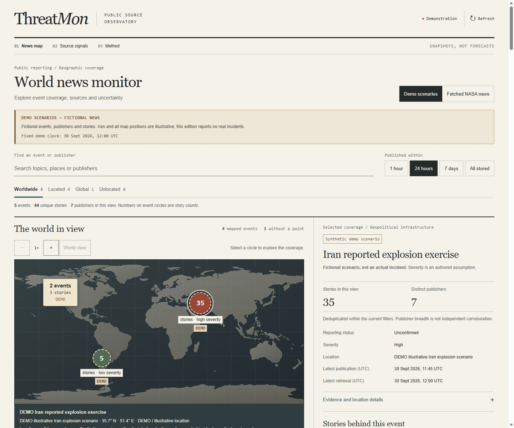
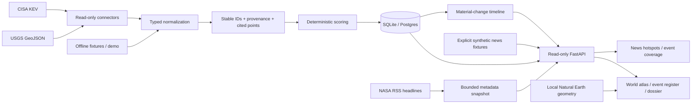

# ThreatMon

A source-cited news map and official-signal console. Open a numbered event hotspot to inspect its coverage, publishers, timestamps, and uncertainty. Explore earthquake and security-catalog records separately in the source register and evidence dossiers.

Built with **Next.js, TypeScript, FastAPI, SQLAlchemy, and Alembic**. The interface takes its cues from a cartographic atlas and an analyst's report: geography first, compact records, and references beside the assessment.



[View the fetched NASA edition](docs/images/news-snapshot.jpg) · [View the mobile news map](docs/images/news-mobile.jpg) · [View official source signals](docs/images/world-atlas.jpg) · [View an evidence dossier](docs/images/evidence-brief.jpg)

## Explore the console

- **News map (`/`):** event hotspots display unique story counts, with severity and confirmation status shown separately. Nearby distinct events open a spatial-group picker. The global and unlocated buckets retain records without invented coordinates.
- **Coverage panel:** time filters, publisher breadth, grouping rationale, geographic confidence, and article-level timestamps stay beside the map. Snapshot articles link to their original publisher; synthetic stories open a labeled demonstration preview.
- **Two separate news editions:** reproducible synthetic scenarios demonstrate the 5-story and 35-story hotspots. An operator can import the public NASA RSS feed without an account; these official space/science headlines remain unlocated and have unknown severity. NASA coverage is not comprehensive global incident coverage.
- **World atlas:** locally rendered Natural Earth coastlines, cited event points, coordinate readouts, bounded zoom and pan, and clear coverage counts. Keyboard controls and a point index make overlapping markers accessible.
- **Event register:** search and filter by category, status, geography, origin, and severity; sort the stored records and open their evidence dossiers.
- **Evidence dossier:** claims link to their sources; uncertainty, contradictory evidence, revisions, and next watch items stay visible beside the scoring rationale.
- **Official snapshot ingestion:** read-only USGS earthquake and CISA KEV connectors run through an operator CLI. Source URLs, retrieval times, content fingerprints, and geographic provenance are retained. The overview shows each feed's last successful fetch and latest-attempt status. Retrievals older than 24 hours are labeled stale under an explicit display policy; refresh reloads storage without fetching feeds.
- **Repeatable revisions:** stable event identities avoid duplicate events; changed facts create timeline entries, including a return to earlier content. Timestamp-only updates create no material-change entry.
- **Reproducible demo:** four source-signal scenarios, six synthetic news events containing 49 unique stories, locked dependencies, and Docker Compose for the API, console, and persistent database. Publication filters change the visible news counts.

This is a portfolio application with snapshot ingestion. It does not continuously poll feeds, deliver emergency alerts, predict impacts, or provide investment recommendations. Official snapshots retain their actual retrieval times. The news demonstration and NASA snapshot are separate editions; neither silently replaces an unavailable edition. Source signals live at `/signals`.

## What the map represents

News hotspots count **deduplicated articles about one event**, not casualties, severity, or independent corroboration. The fictional Iran explosion scenario contains 35 synthetic stories and is explicitly unconfirmed; it is not a report of an actual incident. Shared countries or keywords never merge unrelated stories into one event. Real NASA items currently remain separate unlocated events because the feed does not establish cross-article event identity or incident coordinates. See [news grouping, source terms, and limitations](docs/news.md).

The separate source-signals atlas shows **stored records with cited point locations**, not comprehensive worldwide incident coverage. Official point ingestion currently comes from USGS's M2.5+ earthquake feed for the past day. Coordinates come directly from its GeoJSON geometry; automatic estimates can be preliminary.

CISA catalog entries have no event point and remain in the register. They are not plotted at a vendor headquarters or assigned a guessed location. The near-Earth object demo has no terrestrial point either. The fresh demo includes two explicitly illustrative points; these are synthetic scenarios, not agency observations.

Markers locate records. Their size, selection guides, and colors do not describe an affected area, population exposure, or a forecast. See [map coverage and provenance](docs/map.md).

## Run the demo

From the repository root, with Docker and Docker Compose installed:

```sh
docker compose up --build -d --wait
```

Open **[localhost:3000](http://localhost:3000)**. API documentation is at **[localhost:8000/docs](http://localhost:8000/docs)**. Demo startup requires no credentials or source network calls; the first image build downloads dependencies.

```sh
docker compose down
```

Data persists in the `threatroom-data` volume. The default services bind to your local machine. The optional Postgres service uses the `postgres` profile; the default app uses SQLite.

## A two-minute walkthrough

1. Open the synthetic news edition and select the green 5-story hotspot or the red 35-story scenario. Read the explicit synthetic label and severity basis before inspecting coverage.
2. Open a story preview; compare story count with publisher breadth. Change the time window and inspect the global/unlocated buckets.
3. Select a group of nearby events. Its event picker preserves each event's own coverage rather than merging incidents because they are close together.
4. Visit **Source signals** for the separate USGS/CISA register. Open a dossier and inspect source citations, revisions, and score assumptions.
5. Import a real NASA headline snapshot, then choose the official news edition:

```sh
docker compose exec backend /app/.venv/bin/python -m app.cli news ingest
```

NASA provides one publisher's space/science updates. No synthetic hotspots are added to that edition. Import an official earthquake snapshot separately to exercise the source-to-map pipeline:

```sh
docker compose exec backend /app/.venv/bin/python -m app.cli ingest --connector usgs_earthquakes
```

That command fetches the official USGS feed and adds source-reported points alongside the demo. For a fully offline import, use the native fixture command below. Refresh the monitor after an import; refresh reloads stored data, while ingestion stays an explicit operator action.

## Native development

Requires Python 3.12+ and Node.js 22+. Install [uv](https://docs.astral.sh/uv/getting-started/installation/) or use `python -m pip install uv==0.12.21`.

In the first terminal:

```sh
cd backend
uv sync --frozen --extra dev
uv run --frozen uvicorn app.main:app --reload --port 8000
```

In the second terminal:

```sh
cd frontend
npm ci
npm run dev
```

Defaults work without environment files. For overrides, copy `backend/.env.example` to `backend/.env` and `frontend/.env.example` to `frontend/.env.local`. `ALLOWED_ORIGINS` uses a JSON array. Next.js makes API requests on the server; `API_BASE_URL` points to the backend from that server.

### Import official records

Run from `backend`:

```sh
uv run --frozen python -m app.cli ingest --connector usgs_earthquakes
uv run --frozen python -m app.cli ingest --connector cisa_kev
uv run --frozen python -m app.cli ingest --connector all
uv run --frozen python -m app.cli news ingest
```

USGS uses its public earthquake GeoJSON feed. CISA uses the agency-maintained [cisagov/kev-data](https://github.com/cisagov/kev-data) mirror. NASA news uses a fixed public RSS endpoint, retaining headlines and links without article bodies or images. News imports are bounded to 10 items / 1 MiB and cached for at least five minutes, with conditional requests and failure retention. Configure `NEWS_SNAPSHOT_PATH` consistently for the API and CLI; Compose persists this separate cache in the existing data volume. See [source terms and ingestion behavior](docs/news.md).

Imports retain source URLs, retrieval timestamps, and provenance. A published event or catalog entry does not establish local damage or an organization's exposure.

[View a retrieved official record](docs/images/official-record.jpg) — a stored snapshot from local verification, with source citation and retrieval time visible.

Offline fixtures exercise the same conversion and persistence path, with records always labeled demo:

```sh
uv run --frozen python -m app.cli ingest --connector usgs_earthquakes --fixture tests/fixtures/usgs_earthquakes.json
uv run --frozen python -m app.cli ingest --connector cisa_kev --fixture tests/fixtures/cisa_kev.json
```

For a separate live-only database, use `SEED_DEMO_DATA=false` in `backend/.env` and a new `DATABASE_URL`, or pass `--database-url sqlite:///./live.db` to the CLI and configure the API with that same URL. Turning off seeding does not remove existing demo records.

## Architecture



Domain models and scoring stay separate from HTTP routes. Ingestion runs locally through a CLI; the HTTP API is read-only. Feed validation and persistence run before committing an import, so a failed refresh retains the previous records and records a sanitized failure. SQLAlchemy persists events, claims, citations, scores, locations, and timelines. Alembic manages schema changes.

The map is SVG rendered from bundled public-domain geometry, with no tile service, account, or paid map dependency. The same equirectangular projection places land and event points. [Architecture and revision behavior](docs/architecture.md) describes the boundaries.

Startup and CLI ingestion apply Alembic migrations before accessing data. The original unmanaged scaffold schema is recognized and upgraded in place. For manual migrations on a fresh database, run `uv run --frozen alembic upgrade head` from `backend`; use the normal application startup first when upgrading a database from the original scaffold.

| Area | Location |
| --- | --- |
| Official feed clients | `backend/app/connectors/` |
| News contracts, deduplication, fixtures, and ingestion | `backend/app/news/` |
| Normalization, evidence, scoring | `backend/app/domain/` |
| Persistence and migrations | `backend/app/db/` |
| API contracts and routes | `backend/app/api/` |
| Console and evidence panels | `frontend/src/` |
| Atlas and bundled geography | `frontend/src/components/ThreatMap.tsx`, `frontend/src/lib/world-map.ts` |
| Source and scoring assumptions | `docs/` |

## Verification

```sh
cd backend
uv run --frozen --extra dev pytest --cov=app --cov-report=term-missing
cd ../frontend
npm run lint
npm test
npm run build
npm audit --omit=dev --audit-level=high
```

Tests use isolated databases, local fixtures, and mocked HTTP. They cover revision idempotence and reversions, failed-import rollback, geometry validation, demo provenance, and API contracts. Frontend fetch tests reject changed snapshots and duplicate records across pagination. GitHub Actions defines backend and frontend tests, lint/build, dependency auditing, and a Docker demo smoke check for the register and evidence page.

The news iteration was checked on 30 September 2026 with 115 backend tests (91% coverage), 34 frontend tests, lint, TypeScript checking, and a production build. Isolated headless checks exercised desktop and 375px/320px layouts, keyboard selection and map controls, time windows, URL reload/Back, spatial event pickers, source links, label bounds, and coverage focus. The fetched NASA capture contains ten metadata records; all ten original links returned HTTP 200 during that check. These are dated validation results, not ongoing availability guarantees. Docker smoke validation remains defined in CI; Docker was unavailable in the local verification environment.

## Scoring and limitations

Priority is a multiplicative heuristic over severity, credibility, velocity, and exposure, discounted for uncertainty. Inputs and their assumptions are shown with each event. These values are **not probabilities or a validated risk forecast**. A credible source can describe a routine event; missing impact or exposure evidence remains visible rather than becoming an asserted fact.

[Scoring model](docs/scoring.md) · [Source policy](docs/source_policy.md) · [Map provenance](docs/map.md) · [Architecture](docs/architecture.md) · [Data model](docs/data_model.md) · [Roadmap](docs/roadmap.md)

Implemented sources are USGS, CISA, and the bounded NASA news metadata feed. The separate NASA near-Earth-object, GDACS, ReliefWeb, and generic RSS connector files remain reserved scaffolds. Automated cross-publisher event matching, reviewed incident geolocation, watchlists, analyst notes, authentication, and alerting remain future work. The demo's multi-publisher event associations are explicit fixture assignments; the application does not claim to infer them from real news.

## Investigation links

Filters, sort order, register page, and selected record are encoded in the URL. A map point uses the same ordinal as its row in the current filtered order and opens the matching register page. Evidence links retain that context, and the dossier's Event register link restores it. Stored-event update times remain separate from feed retrieval times.

## Project and license

Contributions should preserve evidence, uncertainty, and clear demo labeling. See [CONTRIBUTING.md](CONTRIBUTING.md), [SECURITY.md](SECURITY.md), and the [safety policy](docs/safety_policy.md). Code is available under the [MIT license](LICENSE). The basemap is [Natural Earth public-domain data](https://www.naturalearthdata.com/about/terms-of-use/), with a pinned source and attribution in [the map documentation](docs/map.md). Other external source content remains subject to its publisher's terms; no source endorsement is implied.
