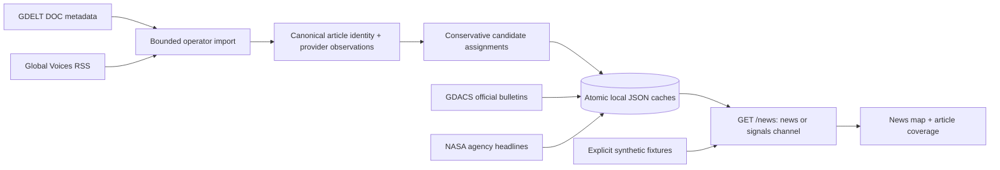
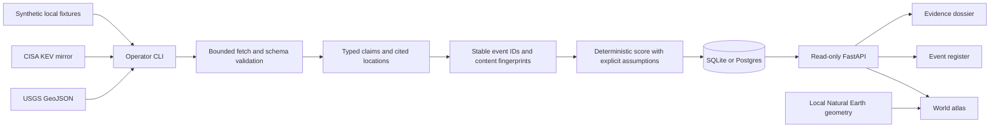

# Architecture

ThreatMon separates news discovery, official-feed ingestion, domain assessment, persistence, and presentation. The operator controls when ingestion happens; browsing and refreshing the console read stored data. The two storage paths below share a read-only FastAPI boundary.

## News discovery path

GDELT discovery is one bounded metadata request per permitted import, with a 250-result cap. Provider timestamps, first collection and actual publication dates remain distinct. Canonical URLs identify articles; a domain count is not independent corroboration. Candidate assignments carry a rule version and revision fingerprint. Unsupported incident geography remains unlocated. See the [complete news contract](news-pipeline.md).

Independent source caches retain last-good records, query watermarks, next permitted attempts and failure status. CLI imports and the optional explicitly started foreground GDELT poller share a cache lock. No scheduler or worker starts with the API. The demo never fills gaps in fetched coverage.

## Official-signal path

## Ingestion Boundary

The two official-signal connectors have fixed source endpoints. HTTP fetching has a 10 MiB response limit, timeouts, and bounded retries. Connector validation accepts the relevant agency schema and preserves source URLs, event identities, timestamps, and input origin. Fixture imports always use distinct demo identities.

The local CLI applies Alembic migrations and ingests a validated feed in a database transaction. Fetch, validation, or persistence failure rolls back that connector's changes and records a sanitized failure. `/ingest/connectors` exposes read-only status, keeping the latest attempt separate from the last successful live import. Fixture runs do not establish live connector success.

There is no HTTP ingestion mutation endpoint, arbitrary feed-URL form or installed scheduler. The optional news poller is separate from this official-signal path.

## Domain and Revision Boundary

Pydantic models represent events, sources, claims, scores, timelines, and optional map locations. Scoring is a deterministic policy with explicit unmeasured baselines; it does not infer organizational exposure or predict impact.

An event ID derives from the connector's stable external identity. A content fingerprint derives from normalized facts, including point geometry when present. Retrieval time, catalog-wide version, and USGS timestamp-only updates do not create material revisions. Repeated current content refreshes metadata. Changed content keeps prior citation/timeline records and replaces the current claim set. An `A → B → A` reversion creates a new occurrence, so the active claims follow the fetched content.

Older USGS revisions are ignored when their source update timestamp precedes the stored revision. Sources from successive versions of one agency record are history rather than independent corroboration.

## Geographic Boundary

Live USGS points copy reported longitude/latitude from GeoJSON and cite the attached source. Seed and fixture points are explicitly illustrative. The model validates numeric ranges, source attachment, and demo/origin consistency. CISA has no incident point; global applicability and vendor location are not geocoded. Nonterrestrial records remain unlocated on the world atlas.

The atlas projects both bundled Natural Earth land geometry and event points with the same equirectangular coordinates. A shared transform keeps markers aligned during bounded zoom and pan. Dragging is available when zoomed; native directional buttons provide keyboard navigation. Marker selection uses native buttons and an alternate point index. [Map documentation](map.md) records coverage limits, visual semantics, projection, and the pinned public-domain source.

## Persistence and API Boundary

SQLAlchemy stores events, point locations, source provenance, claims, score rationale, revision timelines, and ingestion outcomes. SQLite is the default; Postgres is optional. Alembic migrations run at normal startup and CLI initialization. The original unmanaged scaffold schema is recognized before migration rather than recreated.

Repository readback restores UTC to timestamps when SQLite has removed timezone information. The read-only API validates list filters and pagination parameters and supplies demo/live/mixed/empty metadata. Threat detail includes attached sources and current claims. Each list response also carries a SHA-256 `snapshot_id` over the entire matching ordered card collection. Cards, counts, mode, and fingerprint derive from one database read. The frontend loads pages from the Next.js server, rejects inconsistent snapshots or duplicate IDs, and performs interactive filtering with 25-row register pagination. The fingerprint detects changes; it is not a retained cursor or historical snapshot service.

## Scope

The console provides news coverage, a geographic atlas, an official event register and evidence dossiers for stored snapshots. Candidate news matching is implemented but real incident clustering remains unproven in the saved sample. There is no authentication, tenancy, alert delivery or availability guarantee. Geographic coverage is limited by supported source evidence, not by the world extent of the basemap. See the [roadmap](roadmap.md) for future work.
